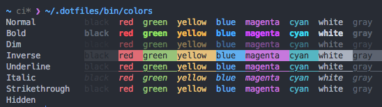
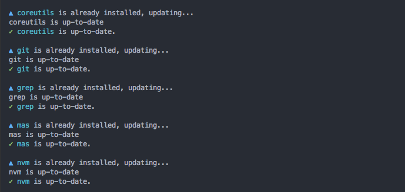

dotfiles
========

> My dotfiles.

Features
--------

- [Atom]
- [Hyper] terminal with Atom One Dark -like theme
- [Zsh] with [Prezto] and one-line [Pure] prompt, and [zsh-syntax-highlighting] configured.
- Sensible Mac OS defaults: see [setup-macos script](../.dotfiles/bin/setup-macos).
- and more... see [setup-* scripts](../.dotfiles/bin/).

[Atom]: https://atom.io/
[Hyper]: https://hyper.is/
[Zsh]: http://www.zsh.org/
[Prezto]: https://github.com/sorin-ionescu/prezto
[Pure]: https://github.com/sindresorhus/pure
[zsh-syntax-highlighting]: https://github.com/zsh-users/zsh-syntax-highlighting

Supported systems
-----------------

- [x] Mac OS [High Sierra]
- [ ] Synology [DiskStation Manager] (DSM)
- [ ] Linux [Debian]
- [ ] Linux [Ubuntu]
- [ ] Linux [Mint]
- [ ] Linux [CentOS]
- [ ] Microsoft [Windows]

[High Sierra]:  https://www.apple.com/lae/macos/high-sierra/
[Debian]: https://www.debian.org/
[Ubuntu]: https://www.ubuntu.com/
[Mint]: https://www.linuxmint.com/
[CentOS]: https://www.centos.org/
[DiskStation Manager]: https://www.synology.com/en-global/dsm
[Windows]: https://www.microsoft.com/en-us/windows

Directory structure
-------------------

### Overview

- `.dotfiles`
  - `bin`: Executable scripts
  - `extra`: Non-script/configuration files
  - `lib`: Shell library files (sourced)
  - `profile.d`: Files sourced at shell login
  - `src`: uncompiled scripts

### `.dotfiles/bin/colors`

Display ANSI shell colors

### `.dotfiles/bin/setup`

Install development software and tools.

License
-------

